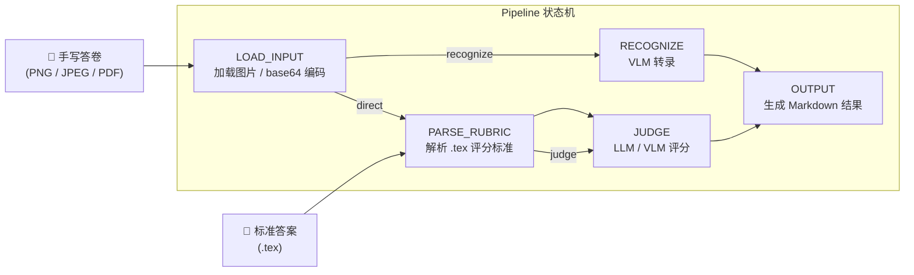
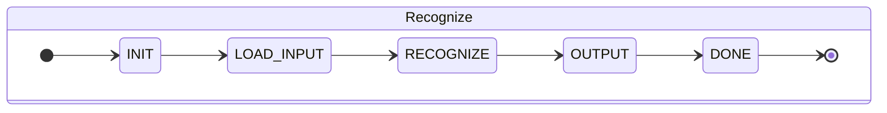
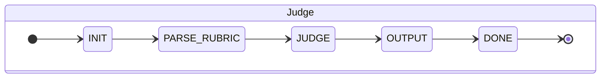
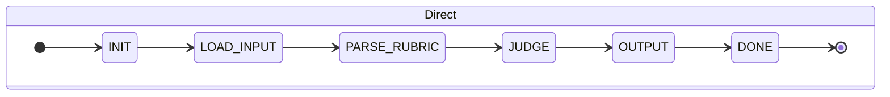

# CPHOS AI 自动阅卷系统

基于视觉语言模型（VLM）和大语言模型（LLM）的物理竞赛手写答卷自动评分系统。

系统提供三种工作模式：

- **Recognize** — VLM 手写识别，将答卷图片转录为 LaTeX Markdown
- **Judge** — LLM 评分，对转录文本按标准答案逐项打分
- **Direct** — VLM 一步完成，直接从图片识别并评分（无需中间转录）

---

## 系统架构



### 三种模式的状态流转





---

## 项目结构

```
AI_Scoring/
├── pyproject.toml                # 项目配置（uv 管理依赖）
├── .env.example                  # 环境变量模板
├── README.md
└── src/
    ├── __init__.py
    ├── __main__.py               # CLI 入口（子命令路由）
    ├── config/                   # 全局配置管理
    │   ├── __init__.py
    │   └── settings.py           # Settings dataclass / get_settings(profile)
    ├── prompt/                   # Prompt 加载器
    │   ├── __init__.py
    │   └── loader.py             # YAML → dict 缓存加载
    ├── prompts/                  # Prompt YAML 资源文件
    │   ├── recognize.yaml        # 卷面识别 prompt
    │   └── judge.yaml            # 评分 prompt（含 direct 模式）
    ├── pipeline/                 # 状态机调度
    │   ├── __init__.py
    │   ├── states.py             # PipelineState / PipelineMode / 转移表
    │   ├── context.py            # PipelineContext（流水线上下文）
    │   ├── handlers.py           # 各阶段处理器
    │   └── pipeline.py           # Pipeline 运行器
    ├── client/                   # 大模型服务商客户端
    │   ├── __init__.py
    │   └── openrouter.py         # OpenRouter API 客户端 + 响应解析
    ├── model/                    # 公用数据类型
    │   ├── __init__.py
    │   └── types.py              # InputAsset, TranscriptionResult
    ├── judge/                    # 评分模块（judge + direct 统一实现）
    │   ├── __init__.py
    │   ├── answer_parser.py      # 解析 .tex 标准答案
    │   ├── prompt_builder.py     # 评分 prompt 构建（文本/图片双模式）
    │   ├── response_parser.py    # LLM JSON 响应解析
    │   ├── output.py             # 评分结果 Markdown 输出
    │   ├── types.py              # ScoringItem, ScoringRubric, JudgingResult
    │   └── service.py            # 编排层 + CLI（judge / direct）
    └── recognize/                # 卷面识别模块
        ├── __init__.py
        ├── input_processing.py   # 图片 / PDF 加载与 base64 编码
        ├── latex_normalizer.py   # LaTeX 文本规范化
        ├── prompt_builder.py     # 识别 prompt 构建
        ├── request_id.py         # 请求 ID 生成
        ├── response_parser.py    # API 响应文本提取
        ├── output.py             # 转录结果 Markdown 输出
        ├── service.py            # 编排层 + CLI
        └── validation.py         # 转录结果校验
```

---

## 快速开始

### 环境要求

- Python 3.11+
- [uv](https://docs.astral.sh/uv/)

### 安装

```bash
cd AI_Scoring
uv sync

# 配置 API Key
cp .env.example .env
# 编辑 .env，填入 OPENROUTER_API_KEY
```

### 卷面识别（Recognize）

将手写答卷图片转录为 LaTeX Markdown。

```bash
# 单张图片
uv run ai-scoring recognize image.png -o result.md

# 批量处理
uv run ai-scoring recognize --input-dir ./images -o ./output/
```

### 文本评分（Judge）

对已转录的学生答案按标准答案打分。

```bash
uv run ai-scoring judge --student student.md --standard answer.tex -o score.md
```

### 直接评分（Direct）

VLM 直接从手写图片识别并评分，跳过转录步骤。

```bash
# 单张
uv run ai-scoring direct image.png --standard answer.tex -o score.md

# 批量
uv run ai-scoring direct --input-dir ./images --standard answer.tex -o ./output/

# 批量 + 4 线程并发
uv run ai-scoring direct --input-dir ./images --standard answer.tex -o ./output/ --concurrency 4
```

| 参数 | 说明 | 可选值 |
|:---|:---|:---|
| `--verbosity` | 评分详细程度 | `0` 仅分数，`1` 简要说明（默认），`2` 完整推理 |
| `--strictness` | 阅卷严厉程度 | `0` 宽松，`1` 混合（默认），`2` 严格 |
| `--concurrency` | 批量评分并发线程数 | 正整数，默认 `1`（串行） |

**严厉程度说明：**

- **0（宽松）** — 关注物理本质，允许合理的等价表述和近似，只要思路正确即可给分
- **1（混合）** — 兼顾物理本质与解题规范，关键步骤和公式必须正确，允许小瑕疵
- **2（严格）** — 严格按评分标准逐项核对，格式、单位、有效数字等均需完全符合要求

---

## 配置

通过 `.env` 文件或环境变量配置：

| 变量 | 说明 | 默认值 |
|:---|:---|:---|
| `OPENROUTER_API_KEY` | OpenRouter API 密钥，多个用英文逗号分隔 | （必填） |
| `VLM_MODEL` | VLM 模型（recognize / direct） | （必填） |
| `JUDGE_MODEL` | 判卷模型（judge） | （必填） |
| `OPENROUTER_BASE_URL` | API 端点 | `https://openrouter.ai/api/v1` |
| `OPENROUTER_TIMEOUT_SECONDS` | 请求超时（秒） | `120` |
| `OPENROUTER_MAX_RETRIES` | 最大重试次数 | `2` |
| `OPENROUTER_RETRY_DELAY` | 重试基础间隔（秒，指数退避） | `1.0` |
| `JUDGE_TIMEOUT_SECONDS` | Judge 请求超时 | 同 `OPENROUTER_TIMEOUT_SECONDS` |
| `DIRECT_VLM_TIMEOUT_SECONDS` | Direct 请求超时 | 同 `OPENROUTER_TIMEOUT_SECONDS` |

---

## 基准测试

`tests/benchmark.py` 用于批量调用 AI 评分并与人工阅卷结果进行对比统计。

> **注意：** 本仓库不提供测试数据集，需自行准备。

### 数据集格式

每个测试用例为 `tests/cases/` 下的一个子目录，结构如下：

```
tests/cases/<case_name>/
├── main.tex        # 标准答案（.tex 格式，含评分标准）
├── score.json      # 人工阅卷分数
├── 1.jpg           # 学生答卷图片
├── 2.jpg
└── ...
```

`score.json` 记录每张答卷图片对应的人工评分总分：

```json
{
    "1.jpg": 6,
    "2.jpg": 12,
    "3.jpg": 20
}
```

### 运行测试

```bash
# 对所有 case 执行 direct 模式评分并统计
uv run python tests/benchmark.py

# 只跑指定 case
uv run python tests/benchmark.py --cases 2 6

# 两步模式（先 recognize 再 judge）
uv run python tests/benchmark.py --mode recognize+judge

# 跳过 AI 评分，仅对 tests/results/ 下已有结果做统计
uv run python tests/benchmark.py --skip-scoring

# 指定严厉程度
uv run python tests/benchmark.py --strictness 2

# 随机抽取最多 50 个样本
uv run python tests/benchmark.py --max-samples 50

# 4 线程并发评分
uv run python tests/benchmark.py --concurrency 4
```

评分结果输出到 `tests/results/<case_name>/`，包含逐项评分 Markdown 和统计摘要 `_benchmark.json`。

统计指标：

| 指标 | 含义 |
|:---|:---|
| Mean Diff | AI 分数与人工分数的平均偏差（正值表示 AI 偏高） |
| MAE | 平均绝对误差 |
| RMSE | 均方根误差 |
| Max \|Diff\| | 最大绝对偏差 |

---

## 许可证

[AGPL-3.0 License](LICENSE)